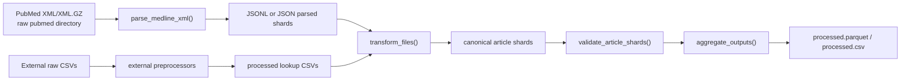

# Architecture

The active implementation is Python-first under `src/pubdelays/`. It has a thin CLI layer, streaming parser, Polars-backed external preprocessors, Polars article transformation, shard validation, aggregation, and SQLite manifest bookkeeping.

## Module boundaries

| Module | Boundary | Main responsibilities |
| --- | --- | --- |
| `src/pubdelays/cli.py` | User and scheduler entry point | Parse arguments, load config, resolve paths, dispatch stages, append manifest rows. |
| `src/pubdelays/config.py` | Configuration | Load TOML, validate required sections and path keys, resolve repository-relative paths. |
| `src/pubdelays/parser/medline.py` | PubMed XML parsing | Stream `.xml`/`.xml.gz`, extract article dictionaries, emit deletion records. |
| `src/pubdelays/external/*.py` | External metadata preprocessing | Normalize SCImago, WoS, DOAJ, NPI, Retraction Watch, and publisher CSVs with Polars. |
| `src/pubdelays/transform/articles.py` | Article filtering and enrichment | Read parsed JSON/JSONL, apply date and journal filters, join lookup tables, write canonical article shards. |
| `src/pubdelays/shards.py` | Shard identity and completeness | Parse `articles-shard-<id>-of-<total>.<format>` names and validate expected sets. |
| `src/pubdelays/aggregate.py` | Final outputs | Scan article shards and write `processed.parquet` plus `processed.csv`. |
| `src/pubdelays/manifest.py` | Audit log | Store stage attempts in SQLite with WAL mode, checksums, byte sizes, row counts, timestamps, worker, metadata, and errors. |
| `src/pubdelays/slurm.py` | Scheduler integration | Render `sbatch` scripts, submit/query jobs, parse statuses. |

## Data flow

The reusable diagram source is [../assets/diagrams/pipeline.mmd](../assets/diagrams/pipeline.mmd).

## Control flow

The CLI is intentionally shallow: `main()` builds the parser, the selected command handler reads config through `cfg()` and `cfg_path()`, then calls the stage module. Mutating stage handlers append manifest rows through `append_manifest()` when they complete, skip, or catch a handled failure.

## Failure boundaries

- Parser outputs and transform outputs are written through temporary files and renamed only after success.
- `--resume` skips only complete, non-empty outputs.
- Local stages append to `data/manifests/pipeline.sqlite` by default.
- SLURM parse and transform array tasks write per-task manifests under `data/manifests/slurm/` and are collected later.
- `aggregate-all` validates shard completeness before writing final outputs unless `--allow-incomplete` is explicitly used.

!!! warning "Do not add shared progress files"
    Parallel workers communicate through files and manifest rows. The SLURM design avoids a shared mutable progress text file and avoids multiple array tasks writing one central SQLite database on a shared filesystem.

## Adjacent references

- [Stage contracts](../internals/stage-contracts.md) for command-level inputs, outputs, resume behavior, and manifest stages.
- [Schemas](../reference/schemas.md) for final columns and shard naming.
- [Invariants](invariants.md) for semantic corrections covered by tests.
