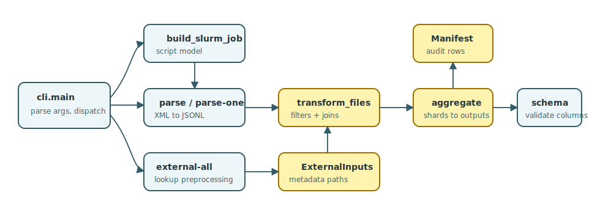

# Getting Started

This is the runbook I would hand to someone joining the project: install the environment, put files where the pipeline expects them, run the stages, then verify the outputs.

## 1. Install

Use Nix when you can:

```bash
nix develop
pubdelays --help
pytest -q
```

Use uv when you are outside the Nix shell:

```bash
scripts/bootstrap_uv.sh
uv run pubdelays --help
uv run pytest -q
```

## 2. Create The Workspace

```bash
pubdelays init-dirs
```

Put PubMed XML/XML.GZ and external metadata under the paths in [Data Layout](data-layout.md), then run:

```bash
pubdelays preflight
```

If preflight is clean, the pipeline has enough input structure to start.

## 3. Understand The Call Graph

The code is intentionally direct. CLI handlers resolve config and paths, then pass those values into parser, transform, aggregate, and manifest helpers.



## 4. Run Locally

```bash
pubdelays download --source baseline --jobs 4 --resume
pubdelays download-external --source all --resume
pubdelays external-all --resume
pubdelays parse --jobs 16 --format jsonl --parse-mesh-subterms --resume
pubdelays validate
pubdelays transform-shards --shards 64 --jobs 16 --format parquet --resume
pubdelays validate-shards --shards 64 --format parquet
pubdelays aggregate-all --resume
pubdelays summaries --resume
pubdelays manifest summary
```

Already have the raw XML and metadata? Skip the download commands. The rest of the pipeline is resume-safe: complete outputs are left alone.

## 5. Run On SLURM

```bash
pubdelays slurm workflow --shards 64 --max-array-size 1001
```

The workflow submits parse, transform-input preparation, transform shards, and aggregation with `afterok` dependencies. Parse and transform arrays write per-task manifests under `data/manifests/slurm/`, which keeps SQLite away from shared-write trouble.

Collect those per-task manifests once after the workflow finishes:

```bash
pubdelays manifest collect \
  --manifest data/manifests/pipeline.sqlite \
  --input-dir data/manifests/slurm
```

## 6. Check The Result

```text
data/processed_data/processed.parquet  # canonical analysis dataset
data/processed_data/processed.csv      # collaborator/export copy
data/processed_data/summaries/         # derived summary tables
```

Validate the final schema:

```bash
pubdelays schema --input data/processed_data/processed.parquet
```

For a 64-shard transform, this should print `64`:

```bash
find data/temp_data/article_parquet -name '*.parquet' | wc -l
```
