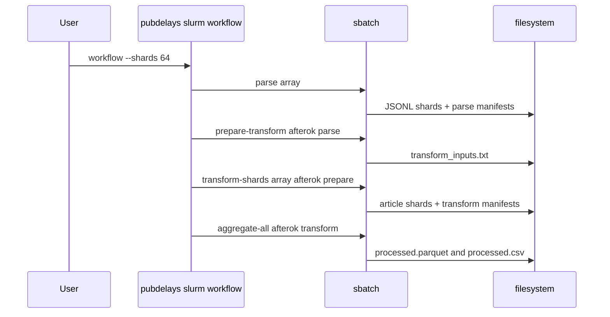

# Production or HPC

SLURM support is optional. Local commands work without a scheduler; `pubdelays slurm` renders `sbatch` scripts using resources from `config/default.toml` or a supplied config.

## Prepare a cluster config

```bash
cp config/default.toml config/hpc.toml
```

Set scheduler fields your cluster requires:

```toml title="config/hpc.toml"
[slurm]
runner = "uv run pubdelays"
log_dir = "logs/slurm"
partition = ""
account = ""
qos = ""
max_array_size = 100
```

`max_array_size` is the configured scheduler array-task limit. The CLI can split oversized arrays and remap logical task IDs.

## Dry-run scripts

```bash
uv run pubdelays --config config/hpc.toml slurm submit parse --dry-run
uv run pubdelays --config config/hpc.toml slurm submit transform-shards --shards 64 --dry-run
uv run pubdelays --config config/hpc.toml slurm workflow --shards 64 --dry-run
```

The parse and transform scripts should include `PUBDELAYS_STAGE_MANIFEST`, which means array workers use per-task SQLite manifests instead of sharing one database.

## Submit workflow

```bash
uv run pubdelays --config config/hpc.toml slurm workflow --shards 64 --max-array-size 100
```



Full diagram source: [../assets/diagrams/slurm-workflow.mmd](../assets/diagrams/slurm-workflow.mmd).

## Monitor and collect manifests

```bash
squeue -u "$USER" -o "%.18i %.30j %.2t %.10M %.30R"
uv run pubdelays --config config/hpc.toml slurm status <job-id>
```

After parse and transform array jobs finish, collect task manifests once:

```bash
uv run pubdelays --config config/hpc.toml manifest collect \
  --manifest data/manifests/pipeline.sqlite \
  --input-dir data/manifests/slurm
```

!!! warning "Collect once"
    `manifest collect` appends rows into the target manifest. Re-running it can duplicate row counts; use output file counts and `validate-shards` as completion signals.

## Recovery

Preview dependency-blocked jobs after an upstream failure:

```bash
uv run pubdelays --config config/hpc.toml slurm cleanup <root-job-id>
```

Cancel only when you pass `--cancel`:

```bash
uv run pubdelays --config config/hpc.toml slurm cleanup <root-job-id> --cancel
```

Validate final outputs:

```bash
uv run pubdelays --config config/hpc.toml validate-shards --shards 64 --format parquet
uv run pubdelays --config config/hpc.toml schema --input data/processed_data/processed.parquet
```
