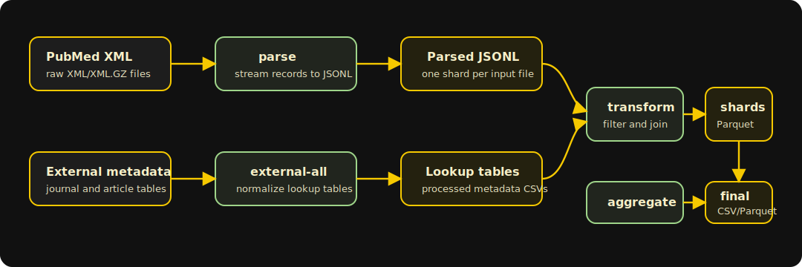
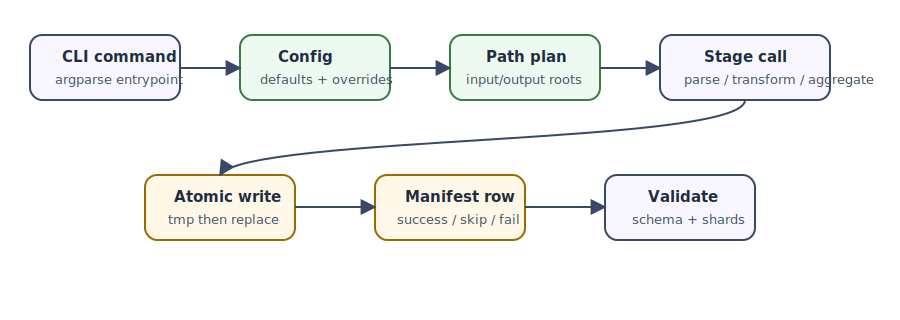

# pubdelays

<div class="hero-grid" markdown>

<div class="hero-card" markdown>
<span class="kicker">PubMed publication delays, without the duct tape</span>

`pubdelays` turns PubMed/MEDLINE XML plus journal metadata into a clean, reproducible publication-delay dataset. It is built for research work: inspectable files, boring commands, explicit schemas, and enough HPC ergonomics to survive a full baseline run.

[Run the pipeline](getting-started.md){ .md-button .md-button--primary }
[Inspect the schema](ANALYSIS_DATASET_V1.md){ .md-button }
</div>

<div class="quick-card" markdown>
**Core loop**

1. parse XML to JSONL
2. normalize external metadata
3. transform article shards
4. aggregate CSV/Parquet
5. keep the manifest trail
</div>

</div>



## What Makes It Usable

- **Readable stages.** Every command maps to a stage with named inputs and outputs.
- **Reproducible paths.** Defaults live in `config/default.toml`; generated artifacts stay under `data/`.
- **Correctness over cleverness.** Date fallbacks, ceased-journal filtering, and final columns are documented where they matter.
- **HPC without mystery state.** SLURM arrays communicate through files and per-task manifests, not shared progress logs.
- **Private metadata stays private.** Licensed peer-review tables can be supplied at run time with `--peer-review` and are never bundled.

## Control Flow

The CLI stays thin: parse arguments, resolve config, call one stage, record what happened.



## Where To Go Next

1. [Getting Started](getting-started.md) if you want the exact commands.
2. [Data Layout](data-layout.md) if you need to find or move files.
3. [CLI Reference](cli.md) when you are scripting a rerun.
4. [HPC and SLURM](hpc-slurm.md) before submitting arrays.
5. [Analysis Dataset V1](ANALYSIS_DATASET_V1.md) before using the final CSV.

## Build These Docs

```bash
uv sync --extra docs
uv run mkdocs serve
```

For a strict build:

```bash
uv run mkdocs build --strict
```
