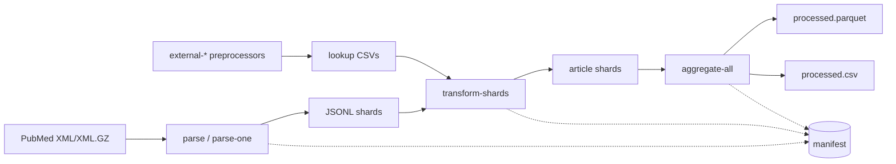

# pubdelays documentation

`pubdelays` is a Python package and CLI for turning PubMed/MEDLINE XML plus journal metadata into an article-level publication-delay dataset. The active code path is under `src/pubdelays/`, uses `lxml` for streaming XML parsing and Polars for tabular preprocessing, transformation, and aggregation.

!!! note "Summary"
    The CLI entry point is `pubdelays` in `pyproject.toml`. Default paths and stage settings are in `config/default.toml`. The public output schema is `analysis_dataset_v1` in `src/pubdelays/schema.py`.

<div class="grid cards" markdown>

-   **Start a run**

    Install the environment, create expected directories, and run the default local workflow.

    [Quickstart](getting-started/quickstart.md)

-   **Pipeline semantics**

    See how PubMed XML, external metadata, transform shards, manifests, and final outputs connect.

    [Architecture](concepts/architecture.md)

-   **Use the CLI**

    Review command families, common options, manifest helpers, and SLURM commands.

    [CLI reference](reference/cli.md)

-   **Inspect the data contract**

    Check final columns, shard naming, file layout, and validation rules.

    [Schemas](reference/schemas.md)

</div>

## Pipeline map



The reusable source for the full diagram is in [assets/diagrams/pipeline.mmd](assets/diagrams/pipeline.mmd).

## Recommended reading order

1. [Installation](getting-started/installation.md) and [quickstart](getting-started/quickstart.md) for a reproducible local setup.
2. [Configuration](getting-started/configuration.md) and [file layout](reference/file-layout.md) before placing raw data.
3. [Architecture](concepts/architecture.md) and [invariants](concepts/invariants.md) before changing semantics.
4. [Stage contracts](internals/stage-contracts.md), [validation](internals/validation.md), and [testing](contributing/testing.md) before running a full corpus or editing code.

## Build this site

```bash
uv sync --extra dev
uv run zensical build
uv run zensical serve
```
