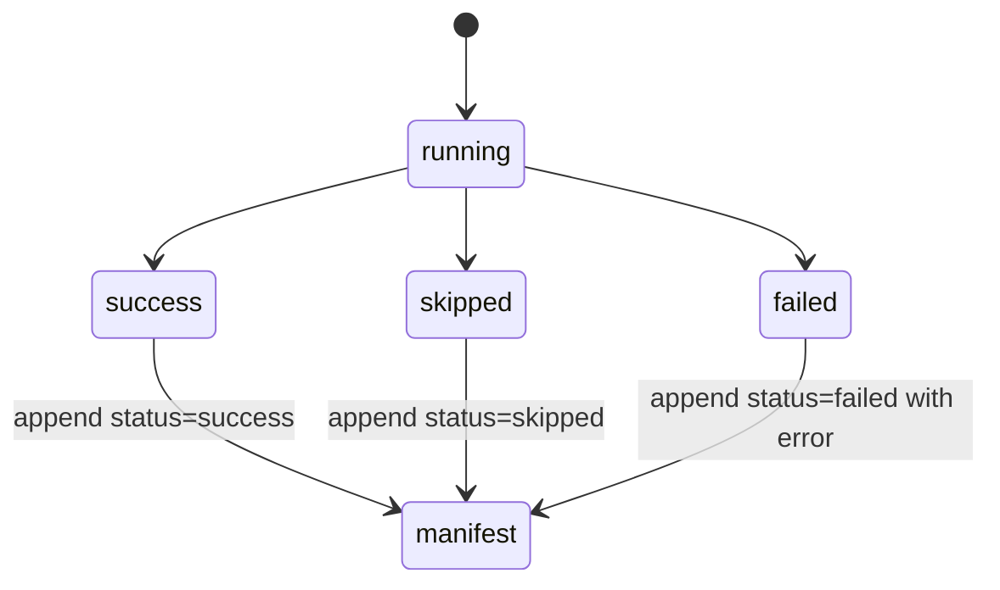

# Error handling

## Manifest statuses

Manifested stages use `success`, `skipped`, or `failed` where the command catches and records failures. A manifest row can include input/output paths, SHA-256 checksums, byte sizes, records, deleted counts, timestamps, elapsed seconds, worker identity, metadata, and error text.



## Atomic outputs and resume

Mutating stages write through temporary files and atomically rename on success. With `--resume`, a stage skips only when the expected output exists and is non-empty. Some aggregate paths require multiple complete outputs before skipping.

## Malformed inputs

- Malformed JSON/JSONL makes `validate` append a `validate-json` failure row and return nonzero.
- External preprocessors append failure rows when the preprocessor raises.
- `parse-one` and `parse` fail fast on malformed XML by default and leave previous complete outputs intact.
- `--recover-malformed-xml` opts into lxml best-effort recovery for explicit salvage runs.
- Not every transform or aggregate exception path currently appends a failed manifest row; this is documented in [stage contracts](stage-contracts.md).

## Recovery commands

```bash
pubdelays manifest failed --limit 50
pubdelays manifest retry-script
pubdelays manifest check --manifest data/manifests/pipeline.sqlite
pubdelays validate-shards --shards 64 --format parquet
```

On SLURM, preview or cancel dependency-blocked jobs with:

```bash
pubdelays slurm cleanup <root-job-id>
pubdelays slurm cleanup <root-job-id> --cancel
```
