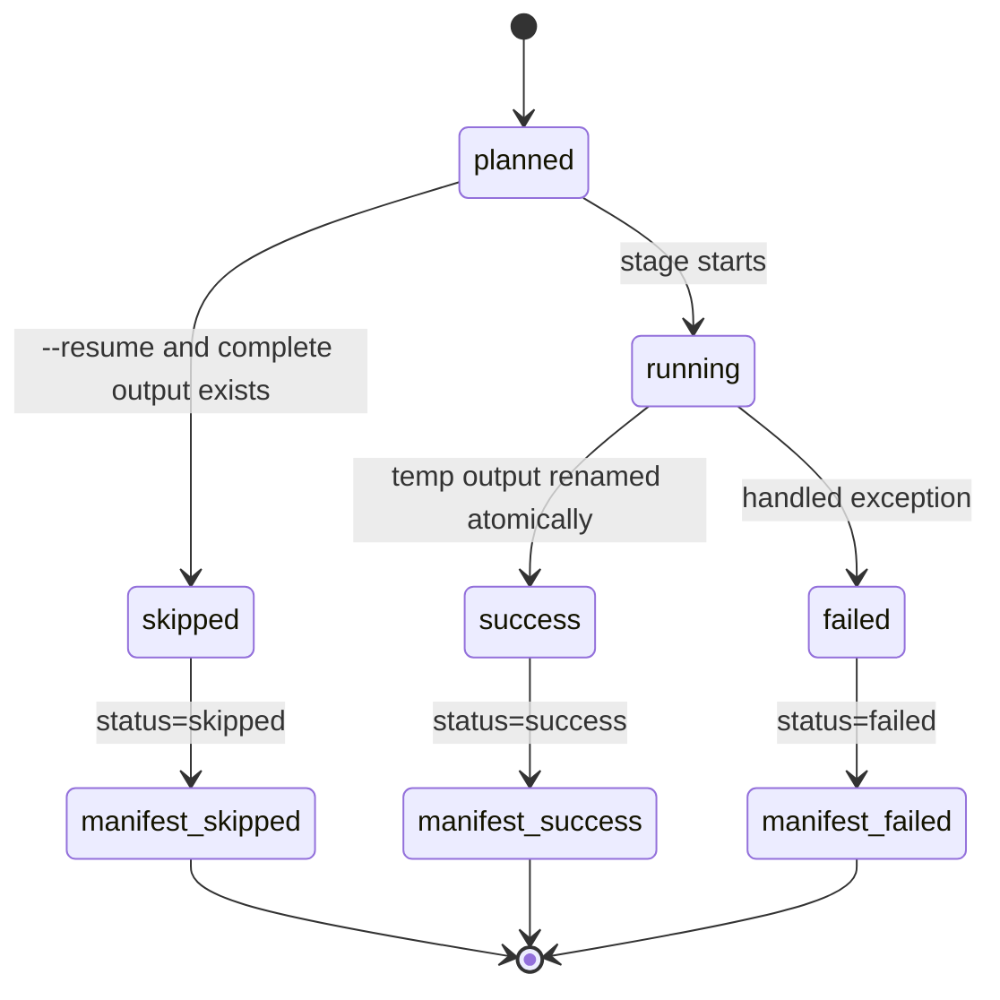

# Pipeline internals

This page maps CLI commands to source functions and files. Use it when you need to modify a stage without rediscovering the call graph.

## Command dispatch

| Function | File | Role |
| --- | --- | --- |
| `main()` | `src/pubdelays/cli.py` | Builds the parser and calls the selected handler. |
| `build_parser()` | `src/pubdelays/cli.py` | Declares commands, subcommands, options, and workflow help text. |
| `cfg()` | `src/pubdelays/cli.py` | Loads the active TOML configuration. |
| `cfg_path()` | `src/pubdelays/cli.py` | Resolves CLI path overrides and config defaults. |
| `manifest_from_args()` | `src/pubdelays/cli.py` | Opens the selected `Manifest`. |
| `append_manifest()` | `src/pubdelays/cli.py` | Builds and appends a `ManifestRow` with optional checksums. |

## Parsing

| Function | File | Input | Output |
| --- | --- | --- | --- |
| `cmd_parse_one()` | `src/pubdelays/cli.py` | One XML/XML.GZ path and output path. | One JSON/JSONL shard and one manifest row. |
| `cmd_parse()` | `src/pubdelays/cli.py` | Configured PubMed XML directory. | One parsed shard per input file. |
| `parse_one()` | `src/pubdelays/cli.py` | One PubMed source file. | Atomic parsed output plus `ParseStats`. |
| `parse_medline_xml()` | `src/pubdelays/parser/medline.py` | XML stream. | Iterator of parsed dictionaries, including deletion records. |

## External metadata

| Function | File | Input | Output |
| --- | --- | --- | --- |
| `cmd_external_all()` | `src/pubdelays/cli.py` | Configured raw metadata paths. | Processed lookup CSVs. |
| `preprocess_scimago()` | `src/pubdelays/external/scimago.py` | Yearly SCImago CSVs. | ISSN/year journal metrics. |
| `preprocess_wos()` | `src/pubdelays/external/wos.py` | Web of Science CSV. | ISSN-keyed discipline and ASJC fields. |
| `preprocess_doaj()` | `src/pubdelays/external/doaj.py` | DOAJ CSV. | ISSN-keyed open-access/APC fields. |
| `preprocess_npi()` | `src/pubdelays/external/npi.py` | Norwegian Publication Indicator CSV. | ISSN-keyed NPI fields. |
| `preprocess_retraction_watch()` | `src/pubdelays/external/retraction_watch.py` | Retraction Watch CSV. | DOI-keyed retraction fields. |
| `preprocess_publisher()` | `src/pubdelays/external/publisher.py` | Optional publisher CSV. | ISSN-keyed publisher fields. |

## Transformation and aggregation

| Function | File | Input | Output |
| --- | --- | --- | --- |
| `cmd_transform_shard()` | `src/pubdelays/cli.py` | `transform_inputs.txt`, shard index, shard count. | One article shard and filter sidecar. |
| `cmd_transform_shards()` | `src/pubdelays/cli.py` | Parsed JSON/JSONL directory. | Input list plus all local shards. |
| `transform_files()` | `src/pubdelays/transform/articles.py` | Parsed records plus `ExternalInputs`. | Canonical article shard and filter counts. |
| `_read_json_frames()` | `src/pubdelays/transform/articles.py` | JSONL/JSON paths. | Polars DataFrame with diagonal-relaxed concatenation. |
| `_left_join_external()` | `src/pubdelays/transform/articles.py` | ISSN-keyed lookup. | Enriched dataframe. |
| `_left_join_peer_review()` | `src/pubdelays/transform/articles.py` | Optional private peer-review table. | Peer-review columns by `doi`, `pmid`, or `title`. |
| `validate_article_shards()` | `src/pubdelays/shards.py` | Article shard directory. | Completeness/schema validation result. |
| `aggregate_outputs()` | `src/pubdelays/aggregate.py` | Article shards. | Final Parquet and CSV outputs. |
| `derive_summary_tables()` | `src/pubdelays/summaries.py` | Final processed dataset. | Summary CSV tables. |

## SLURM execution

| Function | File | Role |
| --- | --- | --- |
| `build_slurm_job()` | `src/pubdelays/cli.py` | Builds stage-specific `SlurmJob` objects. |
| `_split_job_array()` | `src/pubdelays/cli.py` | Splits arrays while keeping task IDs below scheduler limits. |
| `build_sbatch_script()` | `src/pubdelays/slurm.py` | Renders the bash script passed to `sbatch`. |
| `SlurmSubmitter.submit_details()` | `src/pubdelays/slurm.py` | Submits scripts and captures job IDs/errors. |
| `cmd_slurm_cleanup()` | `src/pubdelays/cli.py` | Finds and optionally cancels dependency-blocked jobs. |

## Stage lifecycle

Diagram source: [../assets/diagrams/stage-lifecycle.mmd](../assets/diagrams/stage-lifecycle.mmd).
